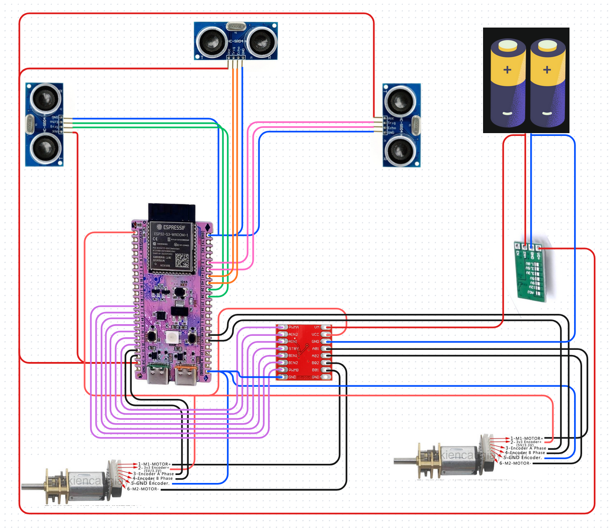

# Micromouse

### Parts used
- Microcontroller: WeAct ESP32-S3-A N16R8 (x1)
- Sensors: HC-SR04 (x3)
- Motor driver:  TB6612FNG (x1)
- Generic GA12 N20 motors (x2)
- Generic 5V DC-DC buck converter (x1)
- Generic 18650 batteries (x2)

### Wiring diagram
